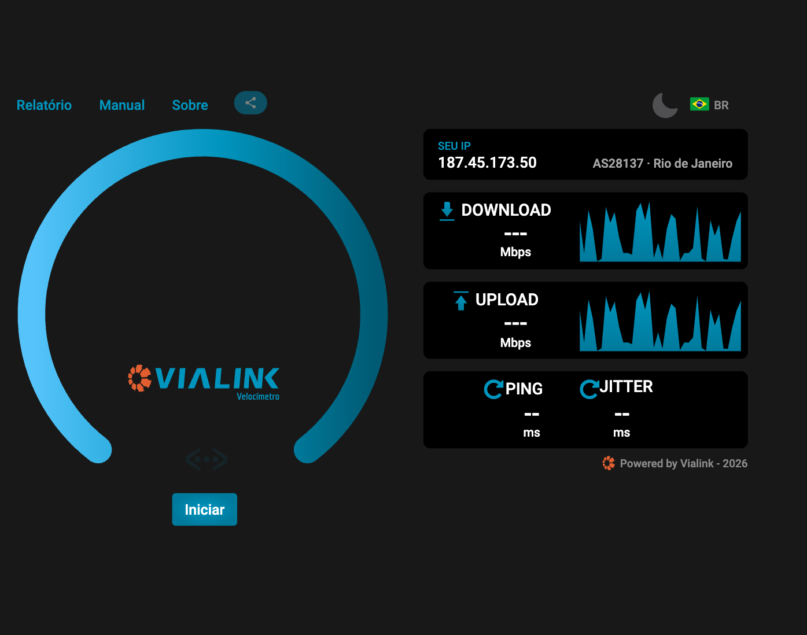
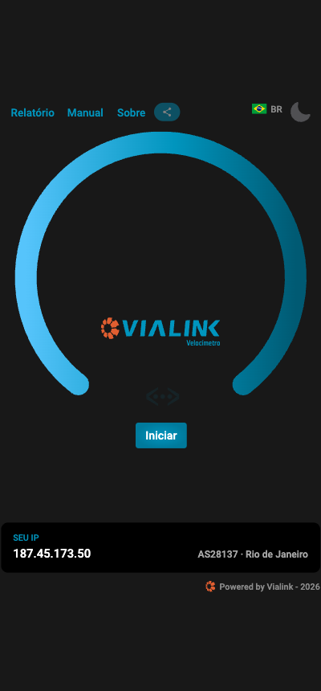
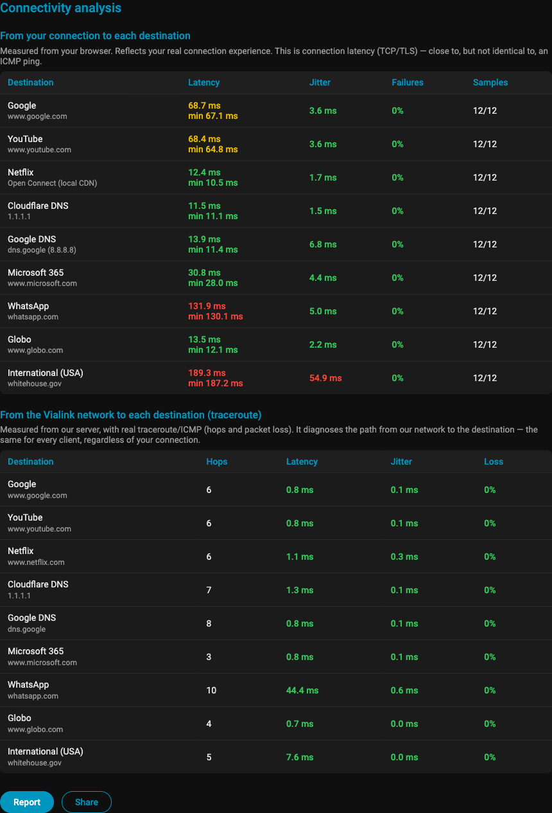
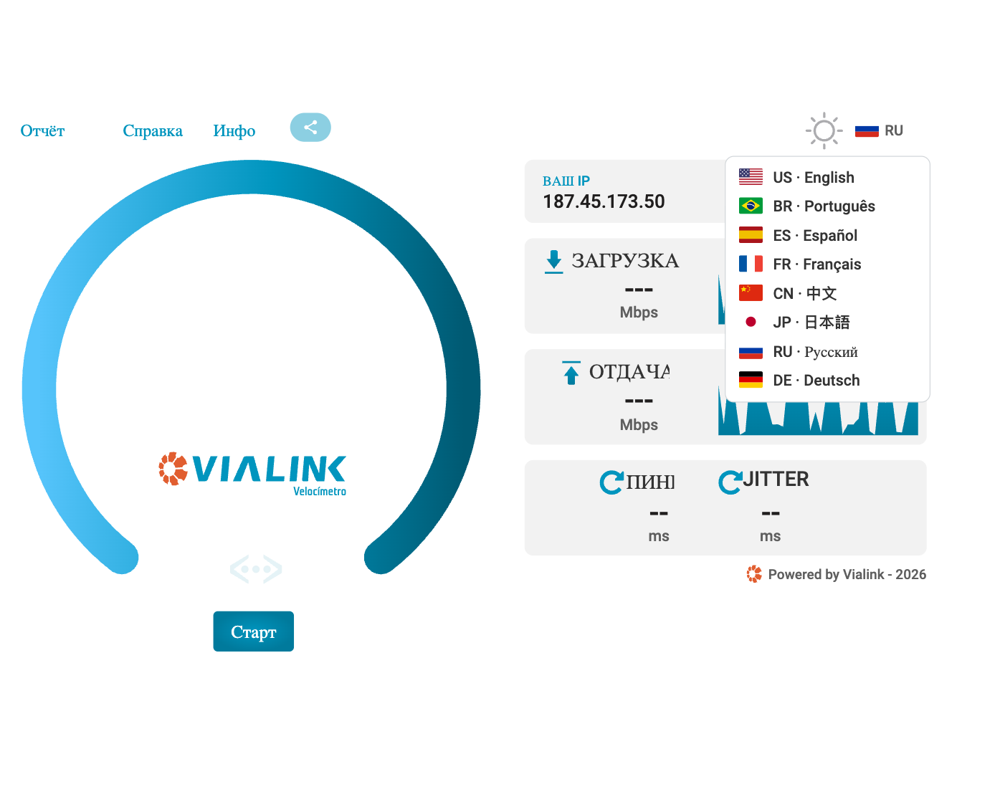

# Vialink Speedtest

Self-hosted, **multi-tenant**, **multi-language** network speed test — a fork
of [OpenSpeedTest™](https://github.com/openspeedtest/Speed-Test). 100% static
files (HTML, CSS, JavaScript and SVG): no build step, no Node.js, no mandatory
backend — any web server will do.

  <a href="https://medidor.vialink.com.br"><strong>▶ Try the live demo</strong></a>
  &nbsp;·&nbsp; <a href="README.pt-BR.md">🇧🇷 Português</a>
  &nbsp;·&nbsp; <a href="docs/INSTALL.en-US.md">Install guide</a>
  &nbsp;·&nbsp; <a href="CHANGELOG.en-US.md">Changelog</a>

  
  

## Highlights

- **Multi-tenant** — several domains on the same installation, each with its
  own logo (light/dark), colors, favicon, title and reports; static
  configuration in [`assets/js/tenants.js`](assets/js/tenants.js).
- **8 languages** — English, Portuguese, Spanish, French, Chinese, Japanese,
  Russian and German, with a flag selector, browser-language detection and a
  cookie-stored preference. [Contribute your language](assets/js/i18n/README.md)
  — it's a single JS file.
- **Fast & Complete tests** — the classic speed test, or a **Complete** run
  that also measures **network health**: latency, jitter and packet loss to
  popular destinations (Google, Netflix, WhatsApp, DNS resolvers…), from **two
  vantage points** — the browser *and* the server (real `traceroute`/ICMP).
- **Connection quality** — what an average in Mbps hides: **bufferbloat**
  (latency measured *while* the link is saturated, graded A+ to F), **initial
  burst vs. sustained** speed, and **stability** (variation, minimum, drops).
  Derived from the speed test itself, at no extra time cost.
- **Single connection vs. 6** — what one TCP flow delivers against the six the
  test uses. This is the answer to "the test says 300 Mbps but Steam downloads
  at 20": per-flow policers, a TCP window too small for the link latency
  (effective window shown, with a 64 KB warning) or an overloaded CGNAT.
- **Usage profiles** — the same numbers as one grade per type of use: video
  calls, 4K streaming, gaming, remote work and VoIP (with an **estimated MOS**,
  ITU-T G.107, computed both with the link idle and with the link busy). Each
  profile is graded by its **worst** criterion, never the average, and names the
  limiting factor — so "500 Mbps" never covers up 300 ms of latency under load.
- **Connection diagnostics** — NAT type with **CGNAT and symmetric NAT**
  detection (why incoming connections fail and why games can't connect
  directly), **path MTU** read from the TCP connection itself (1492 means PPPoE;
  lower means a tunnel), and DNS resolution time. The answers to complaints that
  a speed number cannot explain.
- **Report and PDF** — printable report page (speed **and** network) and a PDF
  generated in the browser (vendored jsPDF, no CDN), shareable through the
  phone's native share sheet.
- **Shareable link** — each test gets a short code (`/r/K7M2QX9P`) that opens the
  full report from any machine, so a customer can send the test to support
  instead of a screenshot. Optional, with result persistence enabled.
- **IP/provider card** — address, ASN, region and **who the block is assigned
  to** (public RDAP registry), which is often more specific than the ASN: a
  sub-allocated block shows the company that actually holds it.
- **Dynamic** gauge scale, dark theme by default, dedicated mobile layout.
- **Fixes over upstream** — a live graph that never rendered, upload payload
  ~160× faster to prepare, threads tuned to HTTP/1.1 — all documented in the
  [CHANGELOG](CHANGELOG.en-US.md).
- **Optional persistence** of results (PHP + MariaDB) for history and
  internal reporting.
- **Privacy** — the server sends nothing to third parties; the test runs
  against *your* infrastructure.

  
  

## Self-hosting

Complete manual (nginx and Apache, HTTPS with Let's Encrypt, multi-tenant
branding, language creation, optional persistence and troubleshooting):

- **English:** [docs/INSTALL.en-US.md](docs/INSTALL.en-US.md)
- **Português:** [docs/INSTALL.pt-BR.md](docs/INSTALL.pt-BR.md)

In short: clone, generate the download blob
(`dd if=/dev/urandom of=downloading bs=1M count=100`), apply the web-server
configuration from the manual and you're done.

## Contributing

Contributions are welcome — especially **new languages** (one dictionary file
+ one SVG flag) and fixes. See [CONTRIBUTING.md](CONTRIBUTING.md).

## License and trademarks

- Code under the **MIT** license — © 2013–2023 OpenSpeedTest™ (original
  project) and © 2026 [Vialink](https://vialink.com.br) (fork modifications).
  See [LICENSE](LICENSE) and [COPYRIGHT.md](COPYRIGHT.md).
- **The Vialink and MaisLink logos, names and colors are not MIT** — when
  hosting publicly, configure a tenant with your own brand
  ([manual, §6](docs/INSTALL.en-US.md#6-branding--logo-colors-and-domains-tenants)).
- OpenSpeedTest™ is a trademark of the original project. This fork is not
  affiliated with OpenSpeedTest; improvements of general interest can be
  proposed back to the
  [original project](https://github.com/openspeedtest/Speed-Test).
